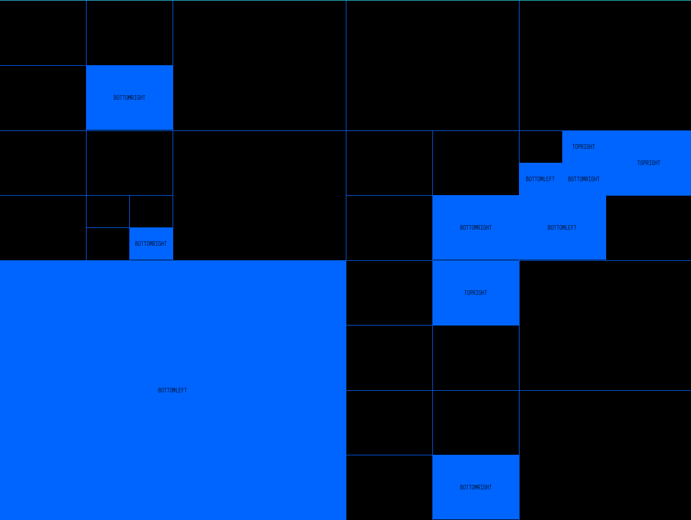

# a quadtree implementation and (not created) simple ui experiment on pygame

Quadtree is a basic tree structure implementation.

## to test you can use github page that serves a webassembly version of it via pygbag
